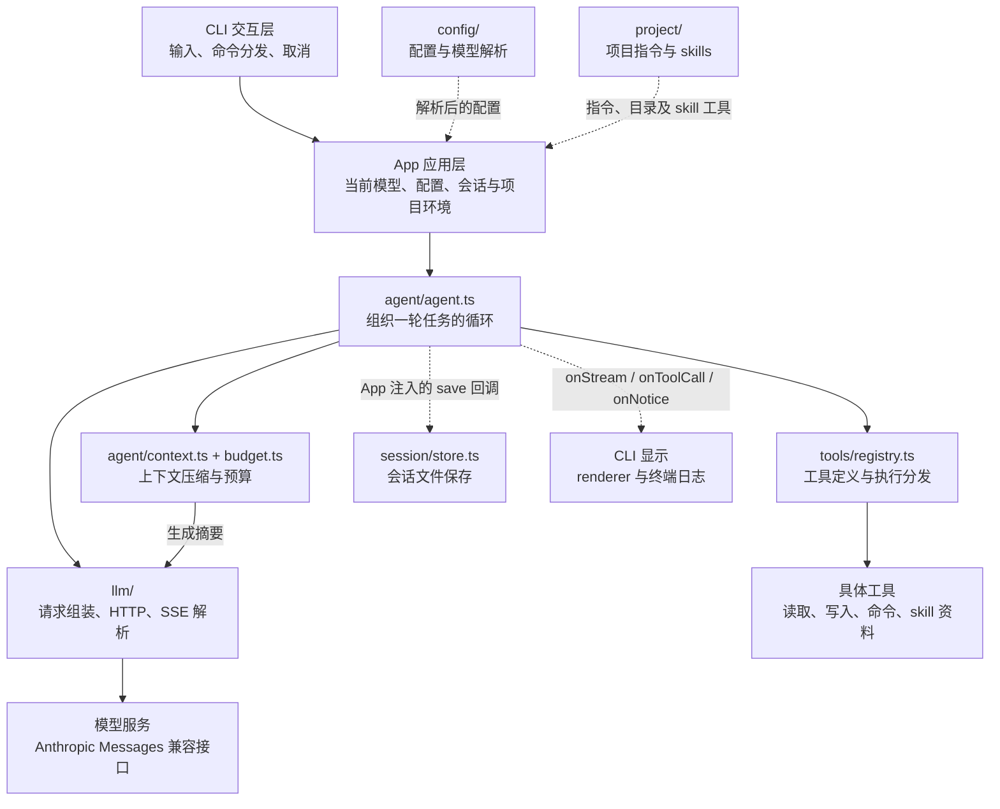
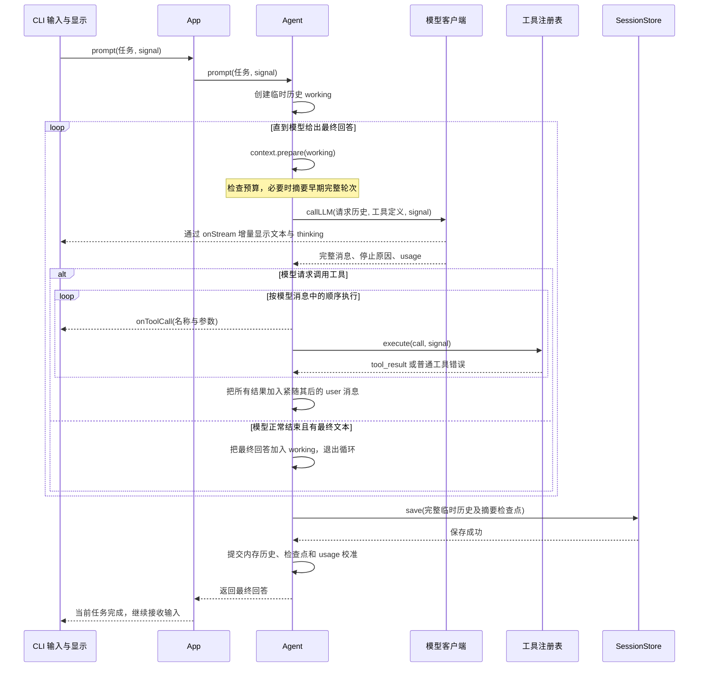
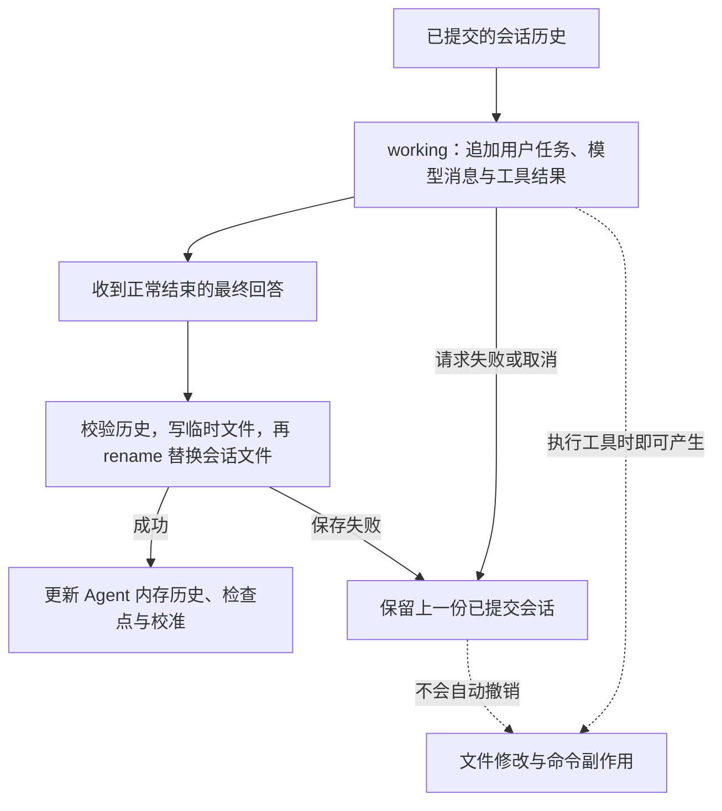
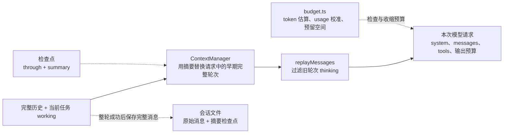

# na 架构导读

na 是一个运行在终端里的 Coding Agent：用户提出任务，模型决定下一步，na 负责提供上下文、执行工具、管理取消和保存会话。这些围绕模型工作的运行机制，就是这里所说的 **agent harness**。

项目使用 TypeScript、Node.js 22+ 和 ESM，直接通过 `fetch` 与 SSE 调用 Anthropic Messages 兼容接口。源码按职责分目录，整体仍是一个 npm 包，由一套 TypeScript 配置构建到 `dist/`。

**第一次阅读：先看「项目全貌」和「一次任务如何执行」，再沿「源码阅读路线」打开代码。** 安装与配置见 [README](../README.md)，开发约束见 [AGENTS.md](../AGENTS.md)，项目指导与 `/init` 的设计取舍见 [harness-design.md](harness-design.md)。本文描述已经实现的行为。

- [项目全貌](#项目全貌)
- [启动与应用组装](#启动与应用组装)
- [一次任务如何执行](#一次任务如何执行)
- [状态如何保存与恢复](#状态如何保存与恢复)
- [历史如何变成模型上下文](#历史如何变成模型上下文)
- [项目指导与工具边界](#项目指导与工具边界)
- [源码阅读路线与改动入口](#源码阅读路线与改动入口)

## 项目全貌

先分清四个词，后面的数据流会更容易理解：

| 名词 | 在 na 中的含义 |
|---|---|
| 模型请求 | 一次向模型发送上下文并接收完整 assistant 消息的过程 |
| 一轮任务 | 一条用户任务消息开始，到模型给出最终回答并成功保存为止；中间可以有多次模型请求和工具调用 |
| 会话 | 多轮已完成任务的历史，可以保存、恢复和继续 |
| Skill | 按需加载的任务说明及参考资料；读取 skill 本身不会执行脚本 |

下面是主要模块的协作关系。实线表示调用，虚线表示数据或回调；省略了类型导入和辅助函数，便于先看清主干。



各层分别回答一个问题：

| 层 | 负责的问题 | 主要入口 |
|---|---|---|
| 启动入口 | 如何启动程序并连接各模块？ | [main.ts](../src/main.ts) |
| CLI | 如何接收输入、解释命令、显示结果和处理 Ctrl+C？ | [cli/repl.ts](../src/cli/repl.ts)、[cli/renderer.ts](../src/cli/renderer.ts) |
| App | 当前使用哪个模型、哪个会话、哪些项目指令和工具？ | [app.ts](../src/app.ts) |
| Agent | 模型下一步要调用工具，还是结束当前任务？ | [agent/agent.ts](../src/agent/agent.ts) |
| 上下文 | 本次请求应带哪些历史，是否还能放进模型窗口？ | [agent/context.ts](../src/agent/context.ts)、[agent/budget.ts](../src/agent/budget.ts) |
| 模型协议 | 如何发送请求、解析流，并得到可信的完整消息？ | [llm/client.ts](../src/llm/client.ts)、[llm/stream.ts](../src/llm/stream.ts) |
| 工具 | 如何把模型给出的工具名称和参数变成一次本地操作？ | [tools/registry.ts](../src/tools/registry.ts) |
| 持久化 | 如何校验、保存并恢复已完成的会话？ | [session/store.ts](../src/session/store.ts)、[agent/history.ts](../src/agent/history.ts) |

**App 与 Agent 的边界是理解项目的关键。** App 协调模型切换、会话恢复和环境重载；Agent 专注当前任务的模型调用循环。Agent 接收工具列表与保存回调，不需要导入具体内置工具、终端界面或 `SessionStore`。

当前 App 操作由 REPL 顺序调用；App 本身没有并发调度器。增加其他调用入口时，也需要遵守这个顺序执行约定。

## 启动与应用组装

[main.ts](../src/main.ts) 的启动顺序如下：

1. `parseArgs()` 解析参数；`--help`、`--version` 直接输出并退出。
2. `loadProjectEnv()` 读取**启动目录**的 `.env`，保留已有进程变量。
3. 创建终端 renderer 和显示回调。
4. `App.create()` 加载配置与项目环境，创建或恢复会话，组装 Agent。
5. `runRepl()` 接管输入循环。

`App.create()` 内部的 `createSession()` 负责把几类来源组合起来：

```text
基础系统提示词 + 项目指令 + skill 元数据 → systemPrompt
builtinTools + skills.tools()           → 完整工具列表
当前配置 + 启动参数或会话保存的选择       → ModelConfig
SessionStore.snapshot                   → initialState
SessionStore.save                       → save 回调
终端显示函数                             → onStream / onToolCall / onNotice
```

对应的构造接口可以在 [AgentOptions](../src/agent/agent.ts) 找到：

```ts
const agent = new Agent({
  model,
  systemPrompt,
  tools: [...builtinTools, ...skills.tools()],
  initialState: session.snapshot,
  save: state => session.save(state),
  onStream,
  onToolCall,
  onNotice,
  limits,
  maxModelCalls,
});
```

这样组织之后，更换终端显示方式无需修改 Agent 循环；新增工具通过组装时传入。当前保存接口仍然是普通异步回调，显示接口仍然是三个回调，没有额外的事件总线或插件运行时。

配置层有两个不同产物：`ConfigCatalog` 是可选模型及设置的目录，`ModelConfig` 是当前模型已经解析好的请求配置。刷新目录不一定切换正在使用的模型。完整配置优先级见 [README 的配置说明](../README.md#配置覆盖与迁移)。

## 一次任务如何执行

假设用户输入：**“修复 `src/example.ts` 的空输入问题，并运行相关测试。”**

REPL 把普通文本交给 `App.prompt()`，再转给 `Agent.prompt()`。下面展示其中一次工具交互；实际可能循环多次。



这里有三处有意设置的边界：

- **流式显示与执行分开。** SSE 到达时即可显示文本，但必须等完整 assistant 消息解析成功、停止原因与工具调用一致后，才执行工具。部分参数或中断的响应不会被当作完整调用执行。
- **模型与本地执行分开。** 模型拿到的是名称、说明和参数 schema；真正的执行函数只保留在本地。`ToolRegistry` 用同一份注册结果生成定义并查找函数，拒绝重复工具名。
- **工具错误与任务失败分开。** 文件找不到、精确替换未匹配、命令非零退出等普通工具错误，以 `is_error: true` 返回模型，模型可以调整后重试；用户取消向上抛出，停止整轮任务。

一次 assistant 消息可能包含多个工具调用，它们的归档顺序是：

```text
user       用户任务
assistant  tool_use(id=A), tool_use(id=B)
user       tool_result(tool_use_id=A), tool_result(tool_use_id=B)
assistant  下一批工具调用，或最终回答
```

[history.ts](../src/agent/history.ts) 检查这种配对和完整轮次结构。当前工具顺序执行；所有结果一起放入下一条 user 消息。工具执行完成后才开始下一次模型请求。

`/model`、`/reload`、`/resume` 等命令由 REPL 分发给应用操作，不作为普通任务发送给模型。两个容易混淆的入口是：`/skill:name` 会先展开 skill 再发起任务；`/compact` 在有可压缩历史时会调用模型生成摘要。

## 状态如何保存与恢复

### 状态分别由谁持有

| 持有者 | 保存什么 | 生命周期 |
|---|---|---|
| REPL | readline、本轮 `AbortController` | 输入循环 / 当前操作 |
| App | 当前 Agent、模型、配置目录、skills、项目指令、SessionStore | 当前应用及会话选择 |
| Agent | 已提交历史、摘要检查点、工具注册表、usage 校准 | 当前会话在内存中的运行状态 |
| `working` 与本轮 ContextManager | 当前任务的临时消息、新检查点与校准 | `prompt()` 执行期间 |
| SessionStore | 最近成功保存的快照与会话元数据 | 内存快照及磁盘文件 |

### 先保存，再提交内存

模型可能已经输出文字、工具可能已经修改文件，但当前任务仍会在后续请求或保存时失败。因此 `Agent.prompt()` 使用临时历史，并把会话提交放在任务末尾。



例如：工具已经修改了文件，下一次模型请求断线。文件修改仍在，但这一轮临时消息不会进入正式会话。**恢复会话只能恢复已保存的完整轮次，当前没有未完成任务的断点续跑记录。** 这个区别决定了后续任务需要重新查看实际文件状态。

会话写在 `<启动目录>/.na/sessions/<id>.json`，内容包括完整消息、摘要检查点和模型选择。模型选择只序列化 provider、模型 ID 和 thinking 强度，不序列化完整认证配置；普通消息和工具输出仍按其原文归档。usage 校准仅保留在内存中。

### 切换与重载也是应用操作

| 操作 | 做什么 | 保留什么 |
|---|---|---|
| `/model <id>`、`/thinking <level>` | 解析候选模型，更新提示词，保存后提交 Agent 和 App 状态 | 会话历史与摘要 |
| `/reload` | 加载项目指令、skills、运行限制，保存后替换环境 | 当前模型配置、thinking 强度和会话历史 |
| `/resume <id>` | 读取会话，用当前配置解析保存的模型选择，加载当前项目指导，再切换 App 状态 | 被恢复会话的完整历史与摘要 |
| `/clear` | 创建新的会话和 Agent | 当前模型选择；旧会话文件继续保留 |

上述保存或准备过程失败时，App 仍保留原先可用的状态。实现见 [app.ts](../src/app.ts)，相关失败场景见 [app.test.ts](../tests/app.test.ts)。

`/model` 不带参数只刷新并展示模型目录，不替当前 Agent 应用新预算；`/reload` 不重读 `.env`，也不自动替换当前模型的服务配置。环境变量变更需重启，模型配置变更需重新选择模型或重启。

### 取消为什么需要等待清理

Ctrl+C 在任务执行期间取消本轮，空闲时退出。REPL 把同一个 `AbortSignal` 沿 App、Agent、模型请求和工具传下去；请求层再合并请求总超时与空闲超时，空闲计时会被 SSE 心跳刷新。

写文件和运行命令必须等待自己的提交或清理结束，再把控制权交回 REPL。否则界面可能已经显示取消，旧操作仍在后台修改文件或运行子进程。文件写入进入 `rename` 提交阶段后会等待其完成；命令取消会终止进程组并清理管道。会话保存进入提交阶段后也会等待完成，因此很晚到达的取消可能对应“本轮已完成保存”。

每轮的 `finally` 只清理本轮状态；整个输入循环结束时才关闭 readline。相关入口是 [cli/repl.ts](../src/cli/repl.ts)、[agent/control.ts](../src/agent/control.ts) 和 [tools/command.ts](../src/tools/command.ts)。

## 历史如何变成模型上下文

完整会话用于恢复和追溯，模型每次请求则受上下文窗口限制。na 保留归档原文，再从中生成本次请求需要的上下文。



检查点 `ContextCheckpoint { through, summary }` 表示：`messages[1..through)` 已经被摘要覆盖，`messages[0]` 是系统提示词。请求保留当前系统提示词、旧历史的摘要、较新的完整轮次和当前任务。

例如，在窗口压力下：

```text
归档与临时历史：system | 第 1 轮 | 第 2 轮 | 第 3 轮 | 当前任务
本次请求视图：  system | 第 1～2 轮的摘要  | 第 3 轮 | 当前任务
```

摘要作为历史背景放入消息中，包含一条 user 摘要消息和 assistant 确认消息。生成摘要需要额外模型请求；全部摘要批次成功后才更新本轮检查点，随后还需随完整任务保存。手动 `/compact` 会单独保存压缩结果。

理解预算时，记住以下约束即可；具体算法在 [budget.ts](../src/agent/budget.ts)，默认值与校验在 [runtime-limits.ts](../src/agent/runtime-limits.ts)：

- **同时检查字符和 token。** 字符上限控制序列化输入规模；token 预算考虑模型窗口、输出预留和安全余量。工具定义与系统提示词也占空间。
- **usage 是校准依据。** 仅当已知 usage 对应的请求前缀仍匹配时，使用它加上新增内容的估算；恢复会话、切换模型、重载或前缀变化后会退回估算。这不是精确 tokenizer。
- **当前任务的工具链保持完整。** 自动压缩只处理早期完整轮次。如果当前任务自身已经放不下，会报错，当前还没有单次长任务续接机制。
- **归档保留 thinking。** 请求回放会过滤旧轮次的 thinking；当前工具调用链的 thinking 与签名保持完整，避免破坏模型协议要求。

`maxModelCalls=0` 只表示主循环调用次数不限，不表示上下文容量无限；摘要请求也不计入这个主循环次数。

## 项目指导与工具边界

### 指令常驻，skill 正文按需读取

系统提示词由 App 拼接：基础行为说明、项目指令、可由模型调用的 skill 元数据。常驻 skill 目录只提供名称、描述和位置；模型通过 `load_skill` 读取正文，通过 `read_skill_file` 读取参考资料。`/skill:name` 则直接把指定 skill 正文加入本轮用户消息。

项目指令仅预加载 Git 根目录到启动目录的路径链，每层选择首个非空的 `AGENTS.override.md`、`AGENTS.md` 或 `CLAUDE.md`；仓库其他子目录的指令和文档引用需要按任务读取。这样能把常驻上下文留给当前任务，避免启动时读入整套项目资料。

[project/init.ts](../src/project/init.ts) 为新项目创建缺失的指令入口和验证 skill，命令清单来自静态发现。它不会执行这些命令，也不会把“发现测试入口”写成“测试已经通过”。

### 工具定义与执行使用同一份注册结果

| 来源 | 工具 | 实现 |
|---|---|---|
| 内置 | `read_file`、`list_files` | [tools/read.ts](../src/tools/read.ts) |
| 内置 | `write_file`、`edit_file` | [tools/write.ts](../src/tools/write.ts) |
| 内置 | `run_command` | [tools/command.ts](../src/tools/command.ts) |
| 发现 skills 后添加 | `load_skill`、`read_skill_file` | [project/skills.ts](../src/project/skills.ts) |

[builtin.ts](../src/tools/builtin.ts) 组合内置工具；App 再加入 skill 工具，交给 Agent 创建 `ToolRegistry`。注册表负责去重、查找和把普通错误转为工具结果，各工具自行校验参数；schema 用来向模型描述参数，注册表当前没有通用 JSON Schema 校验器。

工具以用户**启动目录**为工作基准。项目文件工具检查真实路径，skill 参考文件以对应 skill 目录为边界。`run_command` 通过 `/bin/sh` 执行非交互命令，cwd 检查只限制工作目录，不构成 shell 沙箱。指令与 skill 提供模型指导，也不能替代运行时的强制限制。

当前工具结果是字符串；终端显示文本与 thinking 的流式事件，以及工具开始时的名称和参数。命令 stdout/stderr 在工具完成后返回模型，还没有工具结果的统一实时显示接口。

## 源码阅读路线与改动入口

### 第一次读代码的顺序

| 顺序 | 阅读位置 | 读完应能回答的问题 |
|---|---|---|
| 1 | [main.ts](../src/main.ts) | 程序如何启动？`.env` 在什么时候加载？ |
| 2 | [app.ts](../src/app.ts) 的 `createSession()`、`reload()` | 模型、项目指导、工具和会话如何组装？ |
| 3 | [agent/agent.ts](../src/agent/agent.ts) 的 `prompt()` | 哪些情况下继续请求模型，哪些情况下结束或失败？ |
| 4 | [types.ts](../src/types.ts)、[tools/registry.ts](../src/tools/registry.ts) | 模型消息和本地工具执行如何连接？ |
| 5 | [llm/client.ts](../src/llm/client.ts)、[llm/stream.ts](../src/llm/stream.ts) | 流式输出如何变成可执行的完整消息？ |
| 6 | [agent/context.ts](../src/agent/context.ts)、[session/store.ts](../src/session/store.ts) | 请求上下文和持久化历史为何不同？ |

想看真实输入如何进入循环，再读 [cli/repl.ts](../src/cli/repl.ts)；想理解模型参数和历史 thinking 回放，再读 [llm/model.ts](../src/llm/model.ts)。全部文件的目录树见 [README](../README.md#项目结构)。

### 按改动选择入口和验证

| 想修改什么 | 从哪里开始 | 优先参考的测试 |
|---|---|---|
| 命令、模型切换、会话切换 | `cli/args.ts`、`cli/repl.ts`、`app.ts` | [app.test.ts](../tests/app.test.ts)、[runtime-limits.test.ts](../tests/runtime-limits.test.ts) |
| 新增或调整工具 | 对应 `tools/` 实现、`builtin.ts`；涉及分发时再看 `registry.ts` | [tools.test.ts](../tests/tools.test.ts)，另补具体工具行为验证 |
| 模型配置、环境变量 | `config/config.ts`、`config/env.ts` | [config.test.ts](../tests/config.test.ts)、[env.test.ts](../tests/env.test.ts) |
| 协议请求、预算、摘要 | `llm/`、`agent/budget.ts`、`agent/context.ts` | [context-budget.test.ts](../tests/context-budget.test.ts)；协议覆盖按改动补充 |
| 项目指令、skills、初始化 | `project/` | [skills.test.ts](../tests/skills.test.ts)、[init.test.ts](../tests/init.test.ts) |

TypeScript 改动运行 `npm run typecheck` 和相关测试；CLI 或打包改动还需 `npm run build` 并验证构建后的入口。`npm test` 运行全部 `tests/*.test.ts`，测试使用临时目录与模拟请求；`typecheck` 当前只覆盖 `src/`。具体入口见 [项目验证说明](../.agents/skills/verify-project/SKILL.md)。

修改前特别确认四条约束：**保存成功后才提交状态；工具调用与结果保持配对；取消等待提交或清理；压缩与过滤只改变请求视图，保留归档原文。** 新功能应在这些边界上扩展；例如增加实时工具输出时，先接通工具进度与显示，再决定事件接口，而不把终端输出写进工具调用循环。
